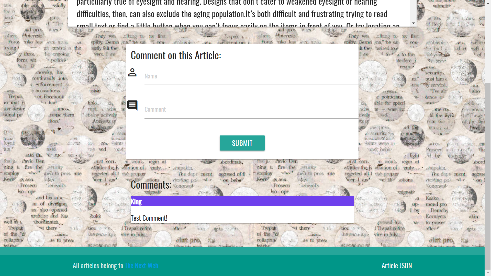

# newScraper

Uses Cheerio to scrape news articles from a site and allows the user to make comments and delete them. Uses Mongoose to store comments and articles.

## Getting Started

Check out the heroku deployed app:  'https://intense-bayou-80892.herokuapp.com/'

## Screen Shots


Scraped news articles from 'The Next Web'


Article page to read each article


Add comments by filling in the form

## Technologies used

- Node.js
- Handlebars - http://handlebarsjs.com/
- MongoDB - https://www.mongodb.com/download-center#community
- Mongoose - http://mongoosejs.com/docs/
- express NPM Package - https://www.npmjs.com/package/express
- express-handlebars NPM Package - https://www.npmjs.com/package/express-handlebars
- cheerio NPM Package - https://www.npmjs.com/package/cheerio
- body-parser NPM Package - https://www.npmjs.com/package/body-parser
- request NPM Package - https://www.npmjs.com/package/request

### Prerequisites

```
- Node.js - Download the latest version of Node https://nodejs.org/en/
- Materialize - Add CDN link: https://cdnjs.cloudflare.com/ajax/libs/materialize/0.97.8/css/materialize.min.css
```

## Built With

* Node
* Mongoose/MongoDB
* Materialize - Wireframe

## Author

* **Jeremy King** - Full Stack Developer - [Jeremy King](https://github.com/KingJeremy2211)